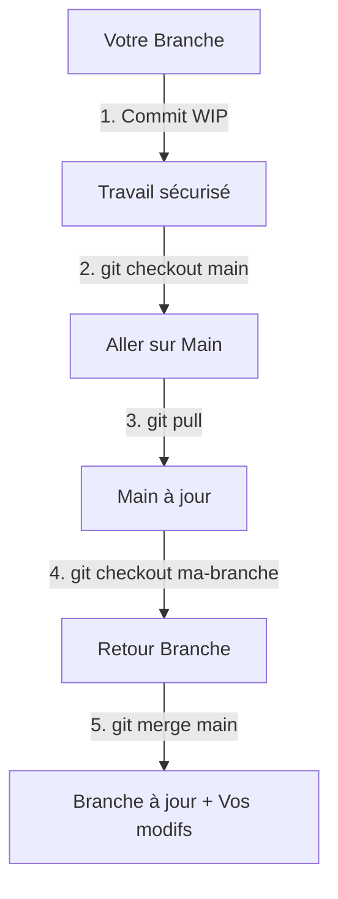

# 🚗 Projet Java Group 3 – Backend Spring Boot (Location de Véhicules)


---

## 📋 Table des matières

### 🚀 Démarrage
1. [Prérequis](#1-prérequis)
2. [Installation avec IntelliJ IDEA (recommandé)](#2-installation-avec-intellij-idea-recommandé)
3. [Lancer le projet sans IDE (optionnel)](#3-lancer-le-projet-sans-ide-optionnel)

### 📂 Comprendre le Projet
4. [Organisation du projet](#4-organisation-du-projet)
5. [Spring Data JPA et SQLite](#5-spring-data-jpa-et-sqlite)
6. [Pourquoi Maven + Spring Boot ?](#6-pourquoi-maven--spring-boot-)

### 🐙 Git & GitHub
7. [Créer un compte GitHub](#7-créer-un-compte-github)
8. [Guide Git pour débutants](#8-guide-git-pour-débutants)
9. [Règles de branches (très important)](#9-règles-de-branches-très-important)
10. [Convention de commits (obligatoire)](#10-convention-de-commits-obligatoire)
11. [Workflow complet pas à pas](#11-workflow-complet-pas-à-pas)
12. [Synchroniser la branche principale avec votre branche personnelle](#12-synchroniser-la-branche-principale-avec-votre-branche-personnelle)
13. [Scénarios Git avancés (avec diagrammes)](#13-scénarios-git-avancés-avec-diagrammes)

### 🛠 Aide & Statut
14. [Problèmes courants et solutions](#14-problèmes-courants-et-solutions)
15. [État actuel du projet](#15-état-actuel-du-projet)
16. [Besoin d'aide ?](#16-besoin-daide-)

---

## 1. Prérequis

### Option recommandée : IntelliJ IDEA (le plus simple)

👉 **Installer uniquement [IntelliJ IDEA Community Edition](https://www.jetbrains.com/idea/download/)**

IntelliJ IDEA gère automatiquement :
- ✅ L'installation du JDK (Java 17)
- ✅ La configuration de Maven
- ✅ L'import du projet
- ✅ L'exécution du serveur

> 💡 **Conseil** : Si vous êtes débutant, utilisez IntelliJ IDEA. Vous n'aurez pratiquement rien à configurer manuellement.
>
> 💡 **Alternative** : **VS Code** est également supporté ! Installez les extensions [Extension Pack for Java](https://marketplace.visualstudio.com/items?itemName=vscjava.vscode-java-pack) et [Spring Boot Extension Pack](https://marketplace.visualstudio.com/items?itemName=vmware.vscode-boot-dev-pack) pour une expérience similaire.

---

## 2. Installation avec IntelliJ IDEA (recommandé)

### Étape 1 : Télécharger et installer IntelliJ IDEA

1. Télécharger : [IntelliJ IDEA Community Edition](https://www.jetbrains.com/idea/download/)
2. Installer en suivant l'assistant d'installation

### Étape 2 : Cloner le projet depuis GitHub

**Méthode A : Via IntelliJ IDEA (recommandé pour débutants)**

1. Lancer IntelliJ IDEA
2. Sur l'écran d'accueil, cliquer sur **Get from VCS**
3. Entrer l'URL du dépôt GitHub
4. Choisir le dossier de destination
5. Cliquer sur **Clone**

**Méthode B : Via terminal**

```bash
git clone <URL_DU_DEPOT>
cd projetjavagroup3
```

### Étape 3 : Ouvrir le projet

1. **File** → **Open** → Sélectionner le dossier du projet
2. IntelliJ détecte automatiquement le projet Maven et le fichier `pom.xml`

### Étape 4 : Installer Java 17 via IntelliJ

Si Java 17 n'est pas installé, IntelliJ vous proposera automatiquement :

1. Une notification apparaît : **Download JDK**
2. Cliquer dessus et choisir :
   - **Version** : `17`
   - **Distribution** : `Eclipse Temurin` (recommandé)
3. Cliquer sur **Download**

> ⚠️ **Important** : Le projet nécessite **Java 17 ou supérieur**. Les versions plus récentes (18, 21, etc.) fonctionnent également.

### Étape 5 : Synchroniser Maven (si nécessaire)

> 💡 **Note** : IntelliJ et VS Code synchronisent souvent Maven automatiquement. Si les dépendances ne se chargent pas, faites-le manuellement :

1. Clic droit sur `pom.xml` dans l'explorateur de fichiers
2. **Maven** → **Reload Project**

Ou bien cliquez sur l'icône 🔄 (Reload) dans la fenêtre Maven (à droite).

### Étape 6 : Lancer le projet

**Option A : Via l'IDE (IntelliJ / VS Code)**

1. Ouvrir le fichier :
   ```
   src/main/java/com/example/projetjavagroup3/Projetjavagroup3Application.java
   ```
2. Cliquer sur ▶️ **Run** à côté de la méthode `main`
   - **IntelliJ** : Bouton vert ▶️ dans la marge gauche
   - **VS Code** : Lien "Run | Debug" au-dessus de la méthode `main`

**Option B : Via le terminal**

```bash
# Windows
.\mvnw.cmd spring-boot:run

# Mac/Linux
./mvnw spring-boot:run
```

Si tout fonctionne, vous verrez dans la console :
```
Started Projetjavagroup3Application
```

🎉 **L'application est maintenant lancée !**

---

## 3. Lancer le projet sans IDE (optionnel)

> ⚠️ Cette méthode demande plus de configuration manuelle.

### Prérequis

- Java 17 installé et configuré dans le PATH
- Maven (ou utiliser le wrapper Maven inclus)

### Commandes

**Sous Windows :**
```bash
mvnw.cmd spring-boot:run
```

**Sous Linux / macOS :**
```bash
./mvnw spring-boot:run
```

---

## 4. Organisation du projet

```
src/
 └─ main/
    ├─ java/
    │   └─ com.example.projetjavagroup3
    │       ├─ Projetjavagroup3Application.java  ← Point d'entrée
    │       ├─ controller/                        ← Contrôleurs REST
    │       ├─ service/                           ← Logique métier
    │       ├─ model/                             ← Entités / Modèles
    │       └─ repository/                        ← Accès aux données
    └─ resources/
        └─ application.properties                 ← Configuration
```

---

## 5. Spring Data JPA et SQLite

> ⚠️ **IMPORTANT** : La base de données **n'est pas obligatoire** pour ce projet !
> 
> Pendant la phase de développement initiale, vous pouvez utiliser :
> - **Des objets en mémoire** (instances de classes Java)
> - **Des fichiers CSV** pour stocker les données
> 
> La migration vers SQLite se fera ultérieurement si nécessaire.

---

> Ce projet utilise **Spring Data JPA** avec une base de données **SQLite**.

> 💡 **Note** : Si vous choisissez de ne pas utiliser de base de données pour l'instant, vous pouvez ignorer la configuration JPA ci-dessous. Utilisez simplement des `List` ou `Map` dans vos Services pour simuler le stockage.

### Configuration de la base de données

La configuration se trouve dans `src/main/resources/application.properties` :

```properties
# SQLite
spring.datasource.url=jdbc:sqlite:database.db
spring.datasource.driver-class-name=org.sqlite.JDBC
spring.jpa.database-platform=org.hibernate.community.dialect.SQLiteDialect
spring.jpa.hibernate.ddl-auto=update
```

### Comment créer une entité (Entity)

Une entité représente une table dans la base de données.

```java
package com.example.projetjavagroup3.model;

import jakarta.persistence.*;
import lombok.Data;

@Entity
@Data  // Lombok génère getters/setters automatiquement
public class User {
    
    @Id
    @GeneratedValue(strategy = GenerationType.IDENTITY)
    private Long id;
    
    private String name;
    private String email;
}
```

### Comment créer un Repository

Le Repository fournit automatiquement les opérations CRUD.

```java
package com.example.projetjavagroup3.repository;

import com.example.projetjavagroup3.model.User;
import org.springframework.data.jpa.repository.JpaRepository;
import org.springframework.stereotype.Repository;

import java.util.List;

@Repository
public interface UserRepository extends JpaRepository<User, Long> {
    
    // Méthodes CRUD automatiques :
    // - save(User user)           → Créer ou mettre à jour
    // - findById(Long id)         → Trouver par ID
    // - findAll()                 → Récupérer tous
    // - deleteById(Long id)       → Supprimer par ID
    
    // Méthodes personnalisées (Spring génère l'implémentation) :
    List<User> findByName(String name);
    List<User> findByEmailContaining(String keyword);
}
```

### Comment utiliser dans un Service

```java
package com.example.projetjavagroup3.service;

import com.example.projetjavagroup3.model.User;
import com.example.projetjavagroup3.repository.UserRepository;
import org.springframework.stereotype.Service;
import lombok.RequiredArgsConstructor;

import java.util.List;

@Service
@RequiredArgsConstructor
public class UserService {
    
    private final UserRepository userRepository;
    
    public User createUser(User user) {
        return userRepository.save(user);
    }
    
    public List<User> getAllUsers() {
        return userRepository.findAll();
    }
    
    public User getUserById(Long id) {
        return userRepository.findById(id)
            .orElseThrow(() -> new RuntimeException("User not found"));
    }
}
```

### Comment créer un Controller REST

```java
package com.example.projetjavagroup3.controller;

import com.example.projetjavagroup3.model.User;
import com.example.projetjavagroup3.service.UserService;
import org.springframework.web.bind.annotation.*;
import lombok.RequiredArgsConstructor;

import java.util.List;

@RestController
@RequestMapping("/api/users")
@RequiredArgsConstructor
public class UserController {
    
    private final UserService userService;
    
    @GetMapping
    public List<User> getAllUsers() {
        return userService.getAllUsers();
    }
    
    @GetMapping("/{id}")
    public User getUser(@PathVariable Long id) {
        return userService.getUserById(id);
    }
    
    @PostMapping
    public User createUser(@RequestBody User user) {
        return userService.createUser(user);
    }
}
```

### Résumé des annotations importantes

| Annotation | Description |
|------------|-------------|
| `@Entity` | Marque une classe comme entité JPA (table) |
| `@Id` | Clé primaire |
| `@GeneratedValue` | ID auto-généré |
| `@Repository` | Interface d'accès aux données |
| `@Service` | Classe de logique métier |
| `@RestController` | Contrôleur REST API |
| `@GetMapping` | Requête HTTP GET |
| `@PostMapping` | Requête HTTP POST |
| `@RequestBody` | Corps de la requête JSON → Objet |
| `@PathVariable` | Paramètre dans l'URL |

---

## 6. Pourquoi Maven + Spring Boot ?

### Maven

**Maven** résout les problèmes de compatibilité entre différents environnements de développement (IDE). Que vous utilisiez IntelliJ IDEA, Eclipse, VS Code ou un autre éditeur, Maven garantit que :

- ✅ Les dépendances sont toujours les mêmes pour tout le monde
- ✅ La structure du projet est standardisée
- ✅ Le build fonctionne de manière identique sur tous les environnements
- ✅ Aucune configuration spécifique à un IDE n'est nécessaire

### Spring Boot

**Spring Boot** simplifie considérablement le développement en fournissant :

- ✅ **Connexion SQL facile** : Spring Data JPA permet de se connecter à la base de données avec une configuration minimale
- ✅ **Génération automatique des getters/setters** : Grâce à **Lombok** (annotation `@Data`), plus besoin d'écrire manuellement les méthodes getters et setters
- ✅ **Auto-configuration** : Spring Boot configure automatiquement la plupart des composants
- ✅ **Moins de code boilerplate** : Concentrez-vous sur la logique métier, pas sur la configuration

#### Exemple Lombok : Avant vs Après

**❌ Sans Lombok (code verbeux) :**
```java
public class User {
    private Long id;
    private String name;
    private String email;

    public Long getId() { return id; }
    public void setId(Long id) { this.id = id; }
    public String getName() { return name; }
    public void setName(String name) { this.name = name; }
    public String getEmail() { return email; }
    public void setEmail(String email) { this.email = email; }
}
```

**✅ Avec Lombok (code simplifié) :**
```java
@Data  // Génère automatiquement tous les getters, setters, toString, equals, hashCode
public class User {
    private Long id;
    private String name;
    private String email;
}
```

#### Exemple SQLite : Configuration simplifiée

**❌ Configuration traditionnelle JDBC (complexe) :**
```java
// Connexion manuelle, gestion des exceptions, fermeture des ressources...
Connection conn = DriverManager.getConnection("jdbc:sqlite:database.db");
PreparedStatement stmt = conn.prepareStatement("SELECT * FROM users WHERE id = ?");
stmt.setLong(1, userId);
ResultSet rs = stmt.executeQuery();
// ... traitement manuel des résultats
```

**✅ Avec Spring Data JPA (simplifié) :**
```java
@Repository
public interface UserRepository extends JpaRepository<User, Long> {
    // C'est tout ! Spring génère automatiquement :
    // - findById(), findAll(), save(), delete(), count()...
}

// Utilisation dans un service :
User user = userRepository.findById(userId).orElseThrow();
```

> 💡 **En résumé** : Maven + Spring Boot = un projet portable, maintenable et productif !

### Comprendre Spring : IoC et Injection de Dépendances

> 🎓 **Section éducative** : Cette partie explique les concepts fondamentaux de Spring pour mieux comprendre le code du projet.

#### Qu'est-ce que l'Inversion de Contrôle (IoC) ?

En programmation traditionnelle, **vous** créez les objets :
```java
// ❌ Approche traditionnelle : création manuelle
UserRepository userRepo = new UserRepository();
UserService userService = new UserService(userRepo);
```

Avec Spring, le **framework** crée et gère les objets pour vous :
```java
// ✅ Approche Spring : le framework s'en charge
@Service
public class UserService {
    @Autowired
    private UserRepository userRepository; // Injecté automatiquement par Spring
}
```

> 💡 **IoC (Inversion of Control)** = Vous ne créez plus les objets vous-même, Spring s'en charge.

#### Qu'est-ce que l'Injection de Dépendances (DI) ?

L'**injection de dépendances** est le mécanisme par lequel Spring fournit automatiquement les objets nécessaires.

```java
@Component
public class AppController {
    
    private final UtilisateurRepository utilisateurRepository;
    private final VehiculeService vehiculeService;
    
    // Spring "injecte" automatiquement les dépendances via le constructeur
    @Autowired
    public AppController(UtilisateurRepository utilisateurRepository, 
                         VehiculeService vehiculeService) {
        this.utilisateurRepository = utilisateurRepository;
        this.vehiculeService = vehiculeService;
    }
}
```

**Pourquoi c'est utile ?**
- ✅ Pas besoin de créer manuellement les objets
- ✅ Les dépendances (comme la connexion à la base de données) sont configurées automatiquement
- ✅ Le code est plus modulaire et testable

#### Pourquoi `context.getBean()` au lieu de `new` ?

Dans `CarRentalApplication.java`, vous verrez :

```java
// ❌ IMPOSSIBLE : AppController a besoin de dépendances !
AppController app = new AppController(); // Erreur : pas de constructeur sans paramètre

// ✅ CORRECT : Récupérer l'instance gérée par Spring
ApplicationContext context = SpringApplication.run(...);
AppController app = context.getBean(AppController.class);
```

**Explication simple** :
1. `AppController` a besoin de `UtilisateurRepository` et `VehiculeService` pour fonctionner
2. Ces dépendances sont connectées à la base de données et configurées par Spring
3. Si on faisait `new AppController()`, ces dépendances seraient `null` → `NullPointerException`
4. En utilisant `getBean()`, on récupère une instance **déjà configurée** avec toutes ses dépendances

#### Les annotations Spring importantes

| Annotation | Rôle | Exemple |
|------------|------|---------|
| `@SpringBootApplication` | Point d'entrée de l'application, active l'auto-configuration | Classe principale |
| `@Component` | Marque une classe comme "bean" géré par Spring | `@Component public class AppController` |
| `@Service` | Spécialisation de `@Component` pour la logique métier | `@Service public class VehiculeService` |
| `@Repository` | Spécialisation de `@Component` pour l'accès aux données | `@Repository public interface VehiculeRepository` |
| `@Autowired` | Demande à Spring d'injecter la dépendance | Sur constructeur ou champ |
| `@Entity` | Marque une classe comme table de base de données | `@Entity public class Vehicule` |

### Comprendre JPA : Mapping Objet-Relationnel

#### Qu'est-ce que JPA ?

**JPA (Java Persistence API)** permet de sauvegarder des objets Java directement dans une base de données, sans écrire de requêtes SQL manuellement.

```java
// Votre classe Java
@Entity
public class Vehicule {
    @Id
    @GeneratedValue
    private Long id;
    private String marque;
    private String modele;
}

// Correspond automatiquement à cette table SQL :
// CREATE TABLE vehicule (
//     id BIGINT PRIMARY KEY AUTO_INCREMENT,
//     marque VARCHAR(255),
//     modele VARCHAR(255)
// );
```

#### Le Repository : Accès simplifié aux données

```java
@Repository
public interface VehiculeRepository extends JpaRepository<Vehicule, Long> {
    
    // ✅ Méthodes CRUD automatiques (pas besoin de les écrire !) :
    // - save(Vehicule v)        → INSERT ou UPDATE
    // - findById(Long id)       → SELECT WHERE id = ?
    // - findAll()               → SELECT *
    // - deleteById(Long id)     → DELETE WHERE id = ?
    // - count()                 → SELECT COUNT(*)
    
    // ✅ Méthodes personnalisées (Spring génère le SQL automatiquement) :
    List<Vehicule> findByMarque(String marque);        // → WHERE marque = ?
    List<Vehicule> findByVilleLocalisation(String v);  // → WHERE ville_localisation = ?
}
```

> 💡 **Magie de Spring Data JPA** : Vous déclarez juste le nom de la méthode, Spring génère automatiquement la requête SQL !

#### Flux complet : De l'objet à la base de données

```
┌─────────────────┐     ┌─────────────────┐     ┌─────────────────┐     ┌─────────────────┐
│   Controller    │ ──▶ │    Service      │ ──▶ │   Repository    │ ──▶ │   Base de       │
│  (AppController)│     │(VehiculeService)│     │(VehiculeRepo)   │     │   données       │
└─────────────────┘     └─────────────────┘     └─────────────────┘     └─────────────────┘
        │                       │                       │                       │
        │  Reçoit les          │  Logique              │  Accès aux            │  Stockage
        │  entrées             │  métier               │  données              │  persistant
        │  utilisateur         │                       │  (CRUD)               │
```

#### Résumé : Pourquoi utiliser Spring + JPA ?

| Sans Spring + JPA | Avec Spring + JPA |
|-------------------|-------------------|
| Créer manuellement toutes les connexions DB | Configuration automatique |
| Écrire des requêtes SQL à la main | Méthodes CRUD générées automatiquement |
| Gérer manuellement les transactions | Gestion automatique des transactions |
| Code répétitif (boilerplate) | Code concis et lisible |
| Dépendances créées manuellement | Injection de dépendances automatique |

---

## 7. Créer un compte GitHub

> 🆕 **Nouveau sur GitHub ?** Suivez ces étapes pour créer votre compte.

### Étape 1 : Créer un compte

1. Aller sur [github.com](https://github.com)
2. Cliquer sur **Sign up** (en haut à droite)
3. Entrer votre adresse email
4. Créer un mot de passe sécurisé
5. Choisir un nom d'utilisateur (sera visible par tous)
6. Vérifier votre email en cliquant sur le lien envoyé

### Étape 2 : Configurer Git sur votre ordinateur

Après avoir créé votre compte, ouvrez un terminal et configurez Git :

```bash
# Configurer votre nom (utilisez le même que sur GitHub)
git config --global user.name "VotreNom"

# Configurer votre email (utilisez le même que sur GitHub)
git config --global user.email "votre@email.com"
```

### Étape 3 : Demander l'accès au dépôt

1. Envoyez votre **nom d'utilisateur GitHub** au responsable du projet
2. Attendez l'invitation par email
3. Acceptez l'invitation dans l'email ou sur [github.com/notifications](https://github.com/notifications)
4. Une fois accepté, vous pourrez pousser votre code sur le dépôt

> 💡 **Conseil** : Choisissez un nom d'utilisateur professionnel car il apparaîtra dans tous vos commits.

---

## 8. Guide Git pour débutants

> 🆕 **Nouveau sur Git ?** Cette section vous explique les commandes essentielles.

### Qu'est-ce que Git ?

Git est un système de contrôle de version. Il permet à plusieurs personnes de travailler sur le même projet sans se marcher sur les pieds.

### Concepts de base

| Terme | Explication |
|-------|-------------|
| **Repository (dépôt)** | Le dossier du projet géré par Git |
| **Commit** | Une "sauvegarde" de vos modifications |
| **Branch (branche)** | Une copie parallèle du projet pour travailler isolément |
| **Merge** | Fusionner une branche dans une autre |
| **Pull** | Récupérer les dernières modifications depuis GitHub |
| **Push** | Envoyer vos modifications vers GitHub |

### Commandes Git essentielles

#### 📥 Récupérer les dernières modifications
```bash
git pull origin main
```
**Quand l'utiliser ?** Avant de commencer à travailler chaque jour.

#### 📂 Voir l'état de vos fichiers
```bash
git status
```
**Quand l'utiliser ?** Pour voir quels fichiers ont été modifiés.

#### ➕ Ajouter des fichiers à commit
```bash
git add .
```
**Quand l'utiliser ?** Après avoir modifié des fichiers et avant de commit.

#### 💾 Créer un commit (sauvegarder)
```bash
git commit -m "feat: description claire de ma modification"
```
**Quand l'utiliser ?** Après avoir ajouté les fichiers avec `git add`.

#### 📤 Envoyer sur GitHub
```bash
git push origin nom-de-ma-branche
```
**Quand l'utiliser ?** Pour partager votre travail avec l'équipe.

---

## 9. Règles de branches (très important)

### ⛔ Règle n°1 : Ne jamais travailler directement sur `main`

> La branche `main` doit **toujours rester stable et fonctionnelle**.
> Elle sert de référence pour tout le monde.

### ✅ Chaque développeur travaille sur sa propre branche

Avant de coder, créez une branche dédiée à votre fonctionnalité.

### Nommage des branches

Utilisez le format suivant :

| Type | Format | Exemple |
|------|--------|---------|
| Nouvelle fonctionnalité | `feature/nom-fonctionnalite` | `feature/user-controller` |
| Correction de bug | `fix/nom-bug` | `fix/login-error` |
| Tests | `test/nom-test` | `test/user-service-tests` |
| Documentation | `docs/nom-doc` | `docs/readme-update` |

### Comment créer une branche ?

```bash
# 1. Se placer sur main et récupérer les dernières modifications
git checkout main
git pull origin main

# 2. Créer votre branche et vous y déplacer
git checkout -b feature/ma-fonctionnalite
```

### Comment changer de branche ?

```bash
# Voir toutes les branches
git branch -a

# Changer de branche
git checkout nom-de-la-branche
```

### Comment supprimer une branche ?

```bash
# Supprimer une branche locale (après merge)
git branch -d feature/ma-fonctionnalite
```

---

## 10. Convention de commits (obligatoire)

Pour garder un historique clair et lisible, **chaque commit doit suivre ce format** :

```
type: description courte et claire
```

### Types de commits

| Type | Description | Exemple |
|------|-------------|---------|
| `feat` | Nouvelle fonctionnalité | `feat: add user registration endpoint` |
| `fix` | Correction de bug | `fix: resolve null pointer in login` |
| `test` | Ajout/modification de tests | `test: add user service unit tests` |
| `docs` | Documentation | `docs: update README setup guide` |
| `refactor` | Amélioration du code | `refactor: simplify user validation logic` |

### ❌ Messages à éviter absolument

- `update`
- `fix`
- `test`
- `wip`
- `first commit`
- `ok`
- `changes`

### ✅ Bons exemples

```bash
git commit -m "feat: add GET /users endpoint"
git commit -m "fix: correct database connection timeout"
git commit -m "docs: add Git workflow instructions"
git commit -m "refactor: extract validation to separate method"
```

---

## 11. Workflow complet pas à pas

> 📋 Suivez ces étapes à chaque fois que vous travaillez sur le projet.

### Avant de commencer à coder

```bash
# 1. Se placer sur main
git checkout main

# 2. Récupérer les dernières modifications
git pull origin main

# 3. Créer une nouvelle branche pour votre travail
git checkout -b feature/nom-de-ma-feature
```

### Pendant le développement

```bash
# 4. Coder vos modifications...

# 5. Vérifier les fichiers modifiés
git status

# 6. Ajouter les fichiers
git add .

# 7. Créer un commit
git commit -m "feat: description de ma modification"
```

### Après avoir terminé

```bash
# 8. Pousser votre branche sur GitHub
git push origin feature/nom-de-ma-feature
```

### Fusionner dans main (via Pull Request)

> ⛔ **OBLIGATOIRE** : Toute fusion dans `main` doit passer par une **Pull Request** avec **revue de code approuvée**.

1. Aller sur GitHub
2. Vous verrez un message proposant de créer une **Pull Request**
3. Cliquer sur **Compare & pull request**
4. Ajouter une description
5. **Demander une revue à un membre de l'équipe** (obligatoire)
6. **Attendre l'approbation** avant de merger
7. Une fois approuvée, cliquer sur **Merge pull request**

> � **Interdit** : Ne **jamais** merger directement sans approbation. Cela permet à l'équipe de relire le code et d'éviter les erreurs.

---

## 12. Synchroniser la branche principale avec votre branche personnelle

> 📥 Ce guide explique comment récupérer les dernières modifications de la branche `main` et les fusionner dans votre branche personnelle.

### Pourquoi synchroniser ?

Quand d'autres membres de l'équipe fusionnent leurs modifications dans `main`, votre branche personnelle devient obsolète. Pour éviter les conflits majeurs, il est recommandé de synchroniser régulièrement.

### Étapes pour synchroniser

```bash
# 1. Sauvegarder vos modifications en cours (si nécessaire)
git add .
git commit -m "wip: sauvegarde avant synchronisation"

# 2. Récupérer les dernières modifications du dépôt distant
git fetch origin

# 3. Basculer sur la branche main
git checkout main

# 4. Mettre à jour votre branche main locale avec le dépôt distant
git pull origin main

# 5. Retourner sur votre branche personnelle
git checkout votre-branche-personnelle
# exp: git checkout kepeng

# 6. Fusionner les modifications de main dans votre branche
git merge main

# 7. Résoudre les conflits s'il y en a (voir section 14)

# 8. Pousser votre branche mise à jour sur GitHub
git push origin votre-branche-personnelle
# exp: git push origin kepeng
```

### Schéma visuel du flux

```
        main (distant)
           │
           ▼
    ┌──────────────┐
    │  git fetch   │  ← Récupère les infos du dépôt distant
    └──────────────┘
           │
           ▼
    ┌──────────────┐
    │  git pull    │  ← Met à jour main locale
    └──────────────┘
           │
           ▼
    ┌──────────────┐
    │  git merge   │  ← Fusionne main dans votre branche
    └──────────────┘
           │
           ▼
    ┌──────────────┐
    │  git push    │  ← Pousse votre branche mise à jour
    └──────────────┘
```

### Commandes raccourcies (une fois maîtrisé)

```bash
# Version courte pour synchroniser rapidement
git checkout main && git pull origin main && git checkout - && git merge main && git push
```

> ⚠️ **Conseil** : Synchronisez votre branche avec `main` au moins une fois par jour pour minimiser les conflits.

---

## 13. Scénarios Git avancés (avec diagrammes)

Ce guide couvre les scénarios les plus courants que vous rencontrerez lors du travail en équipe.

### Scénario 1 : Nouvelle Fonctionnalité

Vous voulez commencer à travailler sur une nouvelle tâche.

#### 🔄 Flux de travail


#### Commandes
```bash
# 1. Toujours partir de main à jour
git checkout main
git pull origin main

# 2. Créer votre branche
git checkout -b feat/ajout-authentification

# 3. Coder... puis vérifier
git status

# 4. Ajouter et valider
git add .
git commit -m "feat: ajouter le formulaire de login"

# 5. Envoyer sur GitHub
git push origin feat/ajout-authentification
```

### Scénario 2 : Synchroniser sa branche (Mettre à jour)

Vos collègues ont mergé du code dans `main` et vous voulez récupérer ces changements dans votre branche **sans perdre votre travail**.

#### 🔄 Flux de travail


#### Commandes
```bash
# 1. Sauvegardez votre travail actuel !
git add .
git commit -m "wip: sauvegarde avant sync"

# 2. Mettez à jour main locale
git checkout main
git pull origin main

# 3. Revenez sur votre branche
git checkout feat/ma-branche

# 4. Fusionnez main DANS votre branche
git merge main

# 5. Si pas de conflit, c'est fini !
```

### Scénario 3 : Résoudre un conflit

💣 **Panique !** Git dit `CONFLICT (content): Merge conflict in ...`

#### Ce qu'il se passe
Git ne sait pas choisir entre votre code et le code de `main` car les deux ont modifié les mêmes lignes.

#### 🛠 Comment réparer (avec IntelliJ)

1. **Ne paniquez pas.**
2. Ouvrez le fichier en rouge (conflit) dans IntelliJ.
3. IntelliJ affiche souvent une fenêtre à 3 volets ou des marqueurs :
    - `<<<<<<< HEAD` (Votre code)
    - `=======` (Séparateur)
    - `>>>>>>> main` (Code venant de main)
4. **Modifiez le fichier** pour garder ce que vous voulez (souvent une combinaison des deux).
5. Une fois le fichier nettoyé (plus de symboles `<<<` `===`), sauvegardez.

#### Commandes après correction manuelle
```bash
# 1. Dites à Git que c'est résolu
git add nom-du-fichier-corrigé.java

# 2. Terminez le merge
git commit -m "fix: resolve merge conflict with main"

# 3. Continuez votre travail
git push origin feat/ma-branche
```

### Scénario 4 : Sauvegarder temporairement (Stash)

Vous êtes en plein travail, mais vous devez changer de branche urgemment pour fixer un bug, et vous ne voulez pas faire un commit "sale".

#### Commandes
```bash
# 1. Mettre de côté vos modifications non terminées
git stash

# La copie de travail est maintenant propre (comme au dernier commit)

# ... Changez de branche, faites votre fix, revenez ...

# 2. Récupérer vos modifications
git stash pop
```

### Scénario 5 : Annuler des modifications

#### Cas A : J'ai modifié un fichier mais je n'ai rien fait d'autre
Je veux annuler mes modifications sur un fichier spécifique pour revenir à l'état du dernier commit.
```bash
git restore mon-fichier.java
```

#### Cas B : J'ai fait un `git add` mais je veux l'annuler (sans perdre mes modifs)
```bash
git restore --staged mon-fichier.java
```

#### Cas C : Je veux TOUT annuler et revenir au dernier commit (Destructeur !)
⚠️ **Attention : supprime définitivement votre travail non commité.**
```bash
git reset --hard HEAD
```

---

## 14. Problèmes courants et solutions

### ❌ Erreur : "Your branch is behind 'origin/main'"

**Solution :**
```bash
git checkout main
git pull origin main
git checkout ma-branche
git merge main
```

### ❌ Erreur : "CONFLICT (content)"

**Solution :**
1. Ouvrir le fichier en conflit dans IntelliJ
2. IntelliJ affiche une interface pour résoudre le conflit
3. Choisir les modifications à garder
4. Après résolution :
```bash
git add .
git commit -m "fix: resolve merge conflicts"
```

### ❌ Erreur : "Permission denied" lors du push

**Solution :**
- Vérifier que vous avez accès au dépôt GitHub
- Vérifier votre configuration SSH ou HTTPS

### ❌ Le projet ne démarre pas

**Vérifications :**
1. Java 17 est-il bien installé ? (Project Structure → SDK)
2. Maven est-il synchronisé ? (Maven → Reload Project)
3. Le port 8080 est-il déjà utilisé ?

---

## 15. État actuel du projet

> 📅 **Dernière mise à jour** : 8 janvier 2026

### Fonctionnalités implémentées

| Module | Description | Statut |
|--------|-------------|--------|
| **Structure du projet** | Architecture Spring Boot MVC | ✅ Terminé |
| **Base de données** | Configuration SQLite avec Spring Data JPA | ✅ Terminé |
| **Entités utilisateurs** | `Utilisateur`, `Agent`, `AgentPro`, `AgentParticulier`, `Loueur` | ✅ Terminé |
| **Entités métier** | `Vehicule`, `Contrat`, `Assurance`, `Entreprise` | ✅ Terminé |
| **Repositories** | `UtilisateurRepository`, `VehiculeRepository` | ✅ Terminé |
| **Services** | `VehiculeService`, `UtilisateurService` | ✅ Terminé |
| **Données de démo** | `DataInitializer` pour initialisation automatique | ✅ Terminé |

---

### Structure des entités

```
entity/
├── Utilisateur.java          ← Classe de base (SINGLE_TABLE inheritance)
│   ├── Agent.java            ← Classe abstraite pour les agents
│   │   ├── AgentPro.java         ← Agent professionnel (SIRET, société)
│   │   └── AgentParticulier.java ← Agent particulier
│   └── Loueur.java           ← Client qui loue des véhicules
├── Vehicule.java             ← Véhicule avec notes et disponibilités
├── Contrat.java              ← Contrat de location
├── Assurance.java            ← Assurance pour véhicules
├── Entreprise.java           ← Entreprise de location
└── GestionCatalogue.java     ← Gestion du catalogue
```

---

### 🔍 JPA dans notre code : Explications détaillées

#### Qu'est-ce que JPA fait concrètement ?

JPA (Java Persistence API) transforme automatiquement vos **objets Java** en **tables de base de données**. Voici comment cela fonctionne dans notre projet :

#### 1️⃣ `@Entity` et `@Table` : Définir une table

```java
@Entity                        // Cette classe = une table dans la BD
@Table(name = "vehicule")      // Nom de la table (optionnel)
public class Vehicule {
    // ...
}
```

**Résultat dans SQLite :**
```sql
CREATE TABLE vehicule (
    id INTEGER PRIMARY KEY AUTOINCREMENT,
    marque TEXT,
    modele TEXT,
    ...
);
```

#### 2️⃣ `@Id` et `@GeneratedValue` : Clé primaire auto-générée

```java
@Id                                              // Clé primaire
@GeneratedValue(strategy = GenerationType.IDENTITY)  // Auto-incrémentation
private int id;
```

**Résultat :** La BD génère automatiquement l'ID (1, 2, 3, ...)

#### 3️⃣ `@Enumerated` : Stocker les énumérations

```java
@Enumerated(EnumType.STRING)   // Stocke "Voiture" au lieu de 0
private TypeVehicule type;

public enum TypeVehicule {
    Voiture,    // Stocké comme texte "Voiture"
    Camion,     // Stocké comme texte "Camion"
    Moto        // Stocké comme texte "Moto"
}
```

**Sans `EnumType.STRING` :** Les valeurs seraient stockées comme 0, 1, 2 (difficile à comprendre dans la BD)

#### 4️⃣ `@ElementCollection` : Collections de valeurs simples

```java
// Dans Agent.java
@ElementCollection
@CollectionTable(
    name = "agent_notes",                        // Nom de la table séparée
    joinColumns = @JoinColumn(name = "agent_id") // Colonne de lien
)
@Column(name = "note")
private List<Integer> notesRecues;
```

**Résultat :** JPA crée une table séparée `agent_notes` :

| agent_id | note |
|----------|------|
| 1 | 4 |
| 1 | 5 |
| 2 | 3 |

#### 5️⃣ `@ManyToOne` : Relation plusieurs-à-un

```java
// Dans Contrat.java
@ManyToOne
private Agent agent;   // Plusieurs contrats peuvent avoir le même agent

@ManyToOne
private Loueur loueur; // Plusieurs contrats peuvent avoir le même loueur
```

**Résultat dans la table `contrat` :**

| id | date_deb | date_fin | agent_id | loueur_id | prix_total |
|-----|----------|----------|----------|-----------|------------|
| 1 | 2026-01-01 | 2026-01-05 | 1 | 2 | 250.00 |

#### 6️⃣ `@Inheritance` : Héritage de classes

```java
// Dans Utilisateur.java
@Entity
@Inheritance(strategy = InheritanceType.SINGLE_TABLE)  // Une seule table pour toute la hiérarchie
@DiscriminatorColumn(name = "user_type")               // Colonne pour distinguer les types
public class Utilisateur { ... }

// Dans Agent.java
@Entity
@DiscriminatorValue("Agent")  // Valeur dans la colonne user_type
public abstract class Agent extends Utilisateur { ... }

// Dans AgentPro.java
@Entity
@DiscriminatorValue("AgentPro")
public class AgentPro extends Agent { ... }
```

**Résultat : Une seule table `utilisateurs` contient tous les types :**

| id | user_type | nom | prenom | email | n_siret | nom_societe |
|----|-----------|-----|--------|-------|---------|-------------|
| 1 | AgentPro | Martin | Jean | jean@mail.com | 123456789 | RentCar |
| 2 | AgentParticulier | Dupont | Marie | marie@mail.com | NULL | NULL |
| 3 | Loueur | Bernard | Pierre | pierre@mail.com | NULL | NULL |

#### 7️⃣ `@Transient` : Ne PAS sauvegarder un champ

```java
@Transient  // Ce champ n'est PAS sauvegardé dans la BD
private double prixCalcule;  // Valeur calculée à la volée
```

**⚠️ Attention :** Si vous mettez `@Transient` sur une relation importante (comme `agent` dans `Contrat`), cette information sera **perdue** après redémarrage !

---

### Détails des entités

#### `Utilisateur.java` - Classe de base

| Attribut | Type | JPA Annotation | Description |
|----------|------|----------------|-------------|
| id | int | `@Id @GeneratedValue` | Clé primaire auto-générée |
| nom | String | - | Nom de famille |
| prenom | String | - | Prénom |
| email | String | `@Column(unique=true)` | Email unique |
| motDePasse | String | - | Mot de passe |
| role | Role | `@Enumerated(STRING)` | Rôle (Loueur/Agent) |

#### `Agent.java` - Agent de location

| Attribut | Type | JPA Annotation | Description |
|----------|------|----------------|-------------|
| notesRecues | List\<Integer\> | `@ElementCollection` | Notes reçues des clients |
| dateRecuFacture | LocalDate | `@Column` | Date de réception facture |
| role | RoleAgent | `@Enumerated(STRING)` | Type d'agent |

#### `Vehicule.java` - Véhicule

| Attribut | Type | JPA Annotation | Description |
|----------|------|----------------|-------------|
| id | int | `@Id @GeneratedValue` | Clé primaire |
| type | TypeVehicule | `@Enumerated(STRING)` | Voiture/Camion/Moto |
| marque | String | - | Marque du véhicule |
| modele | String | - | Modèle |
| couleur | String | - | Couleur |
| etat | EtatVehicule | `@Enumerated(STRING)` | Loué/Non_loué |
| notesRecues | List\<NoteVehicule\> | `@ElementCollection` | Évaluations |
| datesDisponibles | List\<LocalDate\> | - | Dates disponibles |

#### `Contrat.java` - Contrat de location

| Attribut | Type | JPA Annotation | Description |
|----------|------|----------------|-------------|
| id | Long | `@Id @GeneratedValue` | Clé primaire |
| dateDeb | Date | `@Temporal` | Date début |
| dateFin | Date | `@Temporal` | Date fin |
| agent | Agent | `@ManyToOne` | Agent responsable |
| loueur | Loueur | `@ManyToOne` | Client |
| prixTotal | double | - | Prix total |

---

### Repository (`repository/`)

- **`UtilisateurRepository.java`** : Accès aux utilisateurs
  - Méthodes CRUD automatiques via `JpaRepository`
  - `findByEmail(String email)` : Recherche par email

- **`VehiculeRepository.java`** : Accès aux véhicules
  - Méthodes CRUD automatiques
  - `findByType(TypeVehicule type)` : Filtrer par type

---

### Service (`service/`)

- **`VehiculeService.java`** : Logique métier véhicules
  - `afficherTousLesVehicules()` : Liste tous les véhicules
  - `ajouterVehicule(Vehicule v)` : Ajoute un véhicule

- **`UtilisateurService.java`** : Logique métier utilisateurs
  - `connecter(email, mdp)` : Authentification
  - `inscrire(Utilisateur u)` : Inscription

---

### Initialisation des données (`donnee/`)

- **`DataInitializer.java`** : Initialise les données de démonstration
  - S'exécute au démarrage si la BD est vide
  - Crée 2 véhicules (Paris, Toulouse)
  - Crée 2 loueurs + 1 agent professionnel

---

### 📚 JPA Repository API : Guide d'utilisation

#### Qu'est-ce que JpaRepository ?

`JpaRepository` est une interface Spring Data qui fournit automatiquement des méthodes pour manipuler la base de données. **Vous n'avez pas besoin d'écrire de SQL !**

```java
// Définition d'un Repository
@Repository
public interface VehiculeRepository extends JpaRepository<Vehicule, Integer> {
    // JpaRepository<TypeEntité, TypeClePrimaire>
    // Toutes les méthodes CRUD sont automatiquement disponibles !
}
```

---

#### 🔧 Méthodes CRUD automatiques

Ces méthodes sont **disponibles sans aucun code** dès que vous créez un Repository :

| Méthode | Description | Exemple |
|---------|-------------|---------|
| `save(entity)` | Créer ou mettre à jour | `vehiculeRepository.save(v)` |
| `findById(id)` | Trouver par ID | `vehiculeRepository.findById(1)` |
| `findAll()` | Récupérer tous | `vehiculeRepository.findAll()` |
| `deleteById(id)` | Supprimer par ID | `vehiculeRepository.deleteById(1)` |
| `count()` | Compter le nombre total | `vehiculeRepository.count()` |
| `existsById(id)` | Vérifier si existe | `vehiculeRepository.existsById(1)` |

---

#### 📝 Exemples de code concrets

##### 1. Créer / Sauvegarder une entité

```java
// Créer un nouveau véhicule
Vehicule v = new Vehicule(
    Vehicule.TypeVehicule.Voiture,
    "Renault", "Clio", "Bleu",
    Vehicule.EtatVehicule.Non_loué,
    "Rue de la Paix", "75000", "Paris"
);

// Sauvegarder dans la base de données
vehiculeRepository.save(v);  // INSERT INTO vehicule ...

// L'ID est automatiquement généré !
System.out.println("ID généré : " + v.getId());  // Ex: "ID généré : 1"
```

##### 2. Rechercher par ID

```java
// findById retourne un Optional<Vehicule> (peut être vide si non trouvé)
Optional<Vehicule> optVehicule = vehiculeRepository.findById(1);

// Méthode 1 : Vérifier si présent
if (optVehicule.isPresent()) {
    Vehicule v = optVehicule.get();
    System.out.println("Trouvé : " + v.getMarque());
}

// Méthode 2 : Avec valeur par défaut
Vehicule v = vehiculeRepository.findById(1).orElse(null);

// Méthode 3 : Lancer une exception si non trouvé
Vehicule v = vehiculeRepository.findById(1)
    .orElseThrow(() -> new RuntimeException("Véhicule non trouvé !"));
```

##### 3. Récupérer tous les éléments

```java
// Récupérer tous les véhicules
List<Vehicule> tousLesVehicules = vehiculeRepository.findAll();

// Afficher
for (Vehicule v : tousLesVehicules) {
    System.out.println(v.getMarque() + " " + v.getModele());
}

// Ou avec Java Stream
vehiculeRepository.findAll().forEach(v -> 
    System.out.println(v.getMarque())
);
```

##### 4. Mettre à jour une entité

```java
// Récupérer l'entité existante
Vehicule v = vehiculeRepository.findById(1).orElseThrow();

// Modifier les champs
v.setCouleur("Rouge");
v.setEtat(Vehicule.EtatVehicule.Loué);

// Sauvegarder (UPDATE car l'ID existe déjà)
vehiculeRepository.save(v);  // UPDATE vehicule SET couleur='Rouge' WHERE id=1
```

##### 5. Supprimer une entité

```java
// Supprimer par ID
vehiculeRepository.deleteById(1);

// Ou supprimer l'objet directement
Vehicule v = vehiculeRepository.findById(1).orElseThrow();
vehiculeRepository.delete(v);

// Supprimer tous
vehiculeRepository.deleteAll();  // ⚠️ Attention !
```

---

#### 🔍 Méthodes de requête personnalisées

Spring Data peut **générer automatiquement** des requêtes SQL à partir du **nom de la méthode** !

```java
@Repository
public interface VehiculeRepository extends JpaRepository<Vehicule, Integer> {
    
    // Spring génère : SELECT * FROM vehicule WHERE marque = ?
    List<Vehicule> findByMarque(String marque);
    
    // SELECT * FROM vehicule WHERE type = ?
    List<Vehicule> findByType(TypeVehicule type);
    
    // SELECT * FROM vehicule WHERE ville_localisation = ?
    List<Vehicule> findByVilleLocalisation(String ville);
    
    // SELECT * FROM vehicule WHERE marque = ? AND couleur = ?
    List<Vehicule> findByMarqueAndCouleur(String marque, String couleur);
    
    // SELECT * FROM vehicule WHERE etat = ? ORDER BY marque ASC
    List<Vehicule> findByEtatOrderByMarqueAsc(EtatVehicule etat);
    
    // SELECT COUNT(*) FROM vehicule WHERE etat = ?
    long countByEtat(EtatVehicule etat);
    
    // SELECT * FROM vehicule WHERE marque LIKE '%keyword%'
    List<Vehicule> findByMarqueContaining(String keyword);
}
```

##### Mots-clés supportés dans les noms de méthode

| Mot-clé | Exemple | SQL généré |
|---------|---------|------------|
| `And` | `findByMarqueAndCouleur` | `WHERE marque = ? AND couleur = ?` |
| `Or` | `findByMarqueOrCouleur` | `WHERE marque = ? OR couleur = ?` |
| `Between` | `findByPrixBetween` | `WHERE prix BETWEEN ? AND ?` |
| `LessThan` | `findByPrixLessThan` | `WHERE prix < ?` |
| `GreaterThan` | `findByPrixGreaterThan` | `WHERE prix > ?` |
| `Like` | `findByMarqueLike` | `WHERE marque LIKE ?` |
| `Containing` | `findByMarqueContaining` | `WHERE marque LIKE '%?%'` |
| `OrderBy` | `findByTypeOrderByMarqueAsc` | `ORDER BY marque ASC` |
| `Not` | `findByEtatNot` | `WHERE etat != ?` |
| `In` | `findByTypeIn(List)` | `WHERE type IN (?, ?, ?)` |

---

#### 🏗️ Utilisation dans un Service

Voici comment utiliser le Repository dans une classe Service :

```java
@Service
public class VehiculeService {
    
    private final VehiculeRepository vehiculeRepository;
    
    // Injection de dépendance via constructeur
    @Autowired
    public VehiculeService(VehiculeRepository vehiculeRepository) {
        this.vehiculeRepository = vehiculeRepository;
    }
    
    // --- MÉTHODES MÉTIER ---
    
    public List<Vehicule> afficherTousLesVehicules() {
        return vehiculeRepository.findAll();
    }
    
    public Vehicule trouverParId(int id) {
        return vehiculeRepository.findById(id)
            .orElseThrow(() -> new RuntimeException("Véhicule ID " + id + " non trouvé"));
    }
    
    public void ajouterVehicule(Vehicule v) {
        vehiculeRepository.save(v);
    }
    
    public List<Vehicule> rechercherParVille(String ville) {
        return vehiculeRepository.findByVilleLocalisation(ville);
    }
    
    public List<Vehicule> vehiculesDisponibles() {
        return vehiculeRepository.findByEtat(Vehicule.EtatVehicule.Non_loué);
    }
    
    public void supprimerVehicule(int id) {
        if (!vehiculeRepository.existsById(id)) {
            throw new RuntimeException("Véhicule non trouvé !");
        }
        vehiculeRepository.deleteById(id);
    }
}
```

---

#### 🎯 Exemple complet : Flux de données

```
┌──────────────┐     ┌──────────────┐     ┌──────────────┐     ┌──────────────┐
│  Controller  │────▶│   Service    │────▶│  Repository  │────▶│   Database   │
│              │     │              │     │              │     │   (SQLite)   │
└──────────────┘     └──────────────┘     └──────────────┘     └──────────────┘
     
   Utilisateur        Logique métier      Accès aux données     Stockage
   
   // Ex: AppController demande la liste
   vehiculeService.afficherTousLesVehicules()
                           │
                           ▼
                   vehiculeRepository.findAll()
                           │
                           ▼
                   SELECT * FROM vehicule
                           │
                           ▼
                   List<Vehicule> retournée
```

---

#### ⚡ Récapitulatif rapide

| Besoin | Code |
|--------|------|
| Créer/Modifier | `repository.save(entity)` |
| Lire par ID | `repository.findById(id).orElseThrow()` |
| Lire tous | `repository.findAll()` |
| Supprimer | `repository.deleteById(id)` |
| Compter | `repository.count()` |
| Recherche custom | Créer méthode `findByXxx()` dans Repository |

---

### 💉 Injection de Dépendances (Dependency Injection)

#### 📖 Qu'est-ce qu'une "dépendance" ?

Une **dépendance** est un objet dont votre classe a besoin pour fonctionner.

**Exemple concret :**
```java
public class VehiculeService {
    // VehiculeService a BESOIN de VehiculeRepository pour accéder à la BD
    // → VehiculeRepository est une DÉPENDANCE de VehiculeService
    private VehiculeRepository vehiculeRepository;
    
    public List<Vehicule> getAll() {
        return vehiculeRepository.findAll();  // Sans repository, impossible !
    }
}
```

**Autre exemple du quotidien :**
- Une voiture a besoin d'un moteur → Le moteur est une **dépendance** de la voiture
- Un service a besoin d'un repository → Le repository est une **dépendance** du service

---

#### 🤔 Pourquoi l'injection de dépendances ?

**❌ Problème : Créer les dépendances soi-même**

```java
public class VehiculeService {
    // ❌ Création manuelle avec "new"
    private VehiculeRepository vehiculeRepository = new VehiculeRepository();
}
```

**Pourquoi ça ne marche pas ?**
1. `VehiculeRepository` est une **interface**, on ne peut pas faire `new` dessus
2. Même si on pouvait, l'objet ne serait pas connecté à la base de données
3. Spring gère la configuration JPA, pas nous

**✅ Solution : Laisser Spring créer et fournir les dépendances**

```java
@Service
public class VehiculeService {
    private final VehiculeRepository vehiculeRepository;
    
    // ✅ Spring fournit automatiquement un repository configuré et fonctionnel
    public VehiculeService(VehiculeRepository vehiculeRepository) {
        this.vehiculeRepository = vehiculeRepository;
    }
}
```

---

#### 📝 Comment écrire l'injection de dépendances ? (Étape par étape)

##### Étape 1 : Annoter votre classe

Ajoutez une annotation pour que Spring reconnaisse votre classe :

```java
@Service    // Pour les classes de logique métier
// ou @Component  // Pour les classes génériques
// ou @Repository // Pour les classes d'accès aux données
public class VehiculeService {
    // ...
}
```

##### Étape 2 : Déclarer les dépendances comme champs `final`

```java
@Service
public class VehiculeService {
    
    // Déclarer les dépendances dont vous avez besoin
    private final VehiculeRepository vehiculeRepository;      // Dépendance 1
    private final UtilisateurRepository utilisateurRepository; // Dépendance 2
}
```

> 💡 `final` = la dépendance ne peut pas être changée après création (plus sûr)

##### Étape 3 : Créer un constructeur qui reçoit les dépendances

```java
@Service
public class VehiculeService {
    
    private final VehiculeRepository vehiculeRepository;
    private final UtilisateurRepository utilisateurRepository;
    
    // Constructeur : Spring appelle ce constructeur et fournit les objets
    public VehiculeService(VehiculeRepository vehiculeRepository,
                           UtilisateurRepository utilisateurRepository) {
        this.vehiculeRepository = vehiculeRepository;
        this.utilisateurRepository = utilisateurRepository;
    }
}
```

##### Étape 4 : Utiliser les dépendances dans vos méthodes

```java
@Service
public class VehiculeService {
    
    private final VehiculeRepository vehiculeRepository;
    private final UtilisateurRepository utilisateurRepository;
    
    public VehiculeService(VehiculeRepository vehiculeRepository,
                           UtilisateurRepository utilisateurRepository) {
        this.vehiculeRepository = vehiculeRepository;
        this.utilisateurRepository = utilisateurRepository;
    }
    
    // ✅ Maintenant vous pouvez utiliser les dépendances !
    public List<Vehicule> afficherTousLesVehicules() {
        return vehiculeRepository.findAll();
    }
    
    public Utilisateur trouverUtilisateur(int id) {
        return utilisateurRepository.findById(id).orElse(null);
    }
}
```

---

#### 🎯 Modèle complet à copier-coller

```java
import org.springframework.stereotype.Service;
// import des repositories nécessaires

@Service  // ← Étape 1 : Annoter la classe
public class MonService {
    
    // ← Étape 2 : Déclarer les dépendances (final)
    private final MonRepository monRepository;
    private final AutreRepository autreRepository;
    
    // ← Étape 3 : Constructeur avec les dépendances en paramètres
    public MonService(MonRepository monRepository, AutreRepository autreRepository) {
        this.monRepository = monRepository;
        this.autreRepository = autreRepository;
    }
    
    // ← Étape 4 : Utiliser les dépendances
    public List<MonEntite> getAll() {
        return monRepository.findAll();
    }
}
```

---

#### ✨ Résumé : Comment ça marche ?

```
┌─────────────────────────────────────────────────────────────────┐
│                  AU DÉMARRAGE DE L'APPLICATION                  │
├─────────────────────────────────────────────────────────────────┤
│                                                                 │
│  1. Spring scanne le code et trouve @Service, @Repository...   │
│                          ↓                                      │
│  2. Spring crée les objets dans le bon ordre :                  │
│     - D'abord VehiculeRepository (pas de dépendance)            │
│     - Ensuite VehiculeService (dépend de VehiculeRepository)    │
│                          ↓                                      │
│  3. Spring injecte automatiquement les dépendances              │
│     via les constructeurs                                       │
│                          ↓                                      │
│  4. Vos classes sont prêtes à l'emploi !                        │
│                                                                 │
└─────────────────────────────────────────────────────────────────┘
```


#### 🎯 Exemple concret dans notre projet

##### DataInitializer.java

```java
@Component  // Marque cette classe comme un bean Spring
public class DataInitializer implements CommandLineRunner {

    // Dépendances déclarées
    private final VehiculeRepository vehiculeRepository;
    private final UtilisateurRepository utilisateurRepository;

    // ✅ Spring injecte les repositories automatiquement
    public DataInitializer(VehiculeRepository vehiculeRepository, 
                           UtilisateurRepository utilisateurRepository) {
        this.vehiculeRepository = vehiculeRepository;
        this.utilisateurRepository = utilisateurRepository;
    }

    @Override
    public void run(String... args) {
        // On peut utiliser les repositories directement !
        vehiculeRepository.save(new Vehicule(...));
        utilisateurRepository.save(new Loueur(...));
    }
}
```

##### AppController.java

```java
@Component
public class AppController {

    private final UtilisateurRepository utilisateurRepository;
    private final VehiculeService vehiculeService;

    // Spring injecte les deux dépendances
    @Autowired
    public AppController(UtilisateurRepository utilisateurRepository,
                         VehiculeService vehiculeService) {
        this.utilisateurRepository = utilisateurRepository;
        this.vehiculeService = vehiculeService;
    }

    public void startApp() {
        // Utilisation des dépendances injectées
        vehiculeService.afficherTousLesVehicules();
    }
}
```

---

#### 🔄 Comment Spring sait quoi injecter ?

Spring scanne les classes annotées et crée automatiquement des instances :

```
Au démarrage de l'application :
┌─────────────────────────────────────────────────────────────────┐
│ 1. Spring scanne toutes les classes                             │
│                                                                 │
│ 2. Trouve les annotations :                                     │
│    @Component, @Service, @Repository, @Controller               │
│                                                                 │
│ 3. Crée UNE instance de chaque (Singleton par défaut)           │
│                                                                 │
│ 4. Analyse les constructeurs pour trouver les dépendances       │
│                                                                 │
│ 5. Injecte les bonnes instances dans les bons constructeurs     │
└─────────────────────────────────────────────────────────────────┘
```

**Exemple de chaîne d'injection :**

```
VehiculeRepository (créé par Spring)
        │
        ▼
VehiculeService (reçoit VehiculeRepository)
        │
        ▼
AppController (reçoit VehiculeService + UtilisateurRepository)
        │
        ▼
CarRentalApplication (récupère AppController via context.getBean())
```

---

#### ❓ Pourquoi `context.getBean()` dans main() ?

Dans `CarRentalApplication.java` :

```java
public static void main(String[] args) {
    // Spring démarre et crée tous les beans
    ApplicationContext context = SpringApplication.run(CarRentalApplication.class, args);
    
    // ❌ IMPOSSIBLE : new AppController() 
    // → Le constructeur demande des dépendances qu'on n'a pas !
    
    // ✅ CORRECT : Récupérer le bean géré par Spring
    AppController app = context.getBean(AppController.class);
    app.startApp();
}
```

**Explication :**
- La méthode `main()` est statique et n'est pas gérée par Spring
- On doit donc demander à Spring de nous donner l'instance d'`AppController`
- Cette instance a TOUTES ses dépendances déjà injectées et configurées

---

#### 📋 Annotations importantes pour l'injection

| Annotation | Usage | Exemple |
|------------|-------|---------|
| `@Component` | Classe générique gérée par Spring | Utilitaires, helpers |
| `@Service` | Logique métier | `VehiculeService` |
| `@Repository` | Accès aux données | `VehiculeRepository` |
| `@Controller` | Contrôleur web (MVC) | Endpoints REST |
| `@Autowired` | Demande l'injection d'une dépendance | Sur constructeur/champ |

---

#### ⚡ Récapitulatif DI

| Concept | Explication |
|---------|-------------|
| **DI** | Spring crée et fournit les objets automatiquement |
| **Bean** | Objet géré par Spring (classe annotée @Component, etc.) |
| **@Autowired** | "Donne-moi cette dépendance s'il te plaît" |
| **Constructeur** | Meilleure façon d'injecter (final + testable) |
| **context.getBean()** | Récupérer un bean depuis le code non-géré |

---

## 16. Besoin d'aide ?

- Demandez de l'aide sur le groupe de discussion de l'équipe
- Consultez la [documentation Spring Boot](https://docs.spring.io/spring-boot/docs/current/reference/html/)
- N'hésitez pas à poser des questions avant de modifier des fichiers de configuration

---

> ⚠️ **Rappel final** : Toujours `git pull` avant de travailler, toujours créer une branche, toujours suivre la convention de commits !

---

## 💪 L'Esprit d'Équipe

**Ensemble, on va plus loin. Bon code à tous ! 🚀**

---

> 📅 **Dernière mise à jour** : 6 janvier 2026
