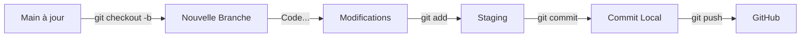
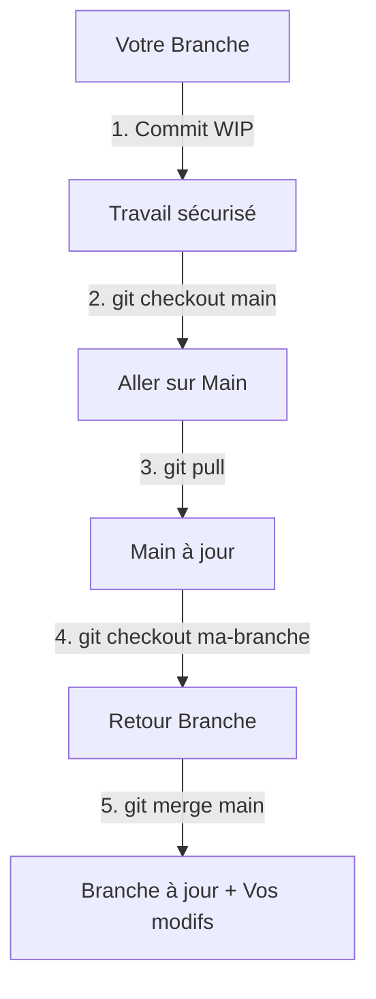

# 🚗 Projet Java Group 3 – Backend Spring Boot (Location de Véhicules)


---

## 📋 Table des matières

### 🚀 Démarrage
1. [Prérequis](#1-prérequis)
2. [Installation avec IntelliJ IDEA (recommandé)](#2-installation-avec-intellij-idea-recommandé)
3. [Lancer le projet sans IDE (optionnel)](#3-lancer-le-projet-sans-ide-optionnel)

### 📂 Comprendre le Projet
4. [Organisation du projet](#4-organisation-du-projet)
5. [Spring Data JPA et SQLite](#5-spring-data-jpa-et-sqlite)
6. [Pourquoi Maven + Spring Boot ?](#6-pourquoi-maven--spring-boot-)

### 🐙 Git & GitHub
7. [Créer un compte GitHub](#7-créer-un-compte-github)
8. [Guide Git pour débutants](#8-guide-git-pour-débutants)
9. [Règles de branches (très important)](#9-règles-de-branches-très-important)
10. [Convention de commits (obligatoire)](#10-convention-de-commits-obligatoire)
11. [Workflow complet pas à pas](#11-workflow-complet-pas-à-pas)
12. [Synchroniser la branche principale avec votre branche personnelle](#12-synchroniser-la-branche-principale-avec-votre-branche-personnelle)
13. [Scénarios Git avancés (avec diagrammes)](#13-scénarios-git-avancés-avec-diagrammes)

### 🛠 Aide & Statut
14. [Problèmes courants et solutions](#14-problèmes-courants-et-solutions)
15. [État actuel du projet](#15-état-actuel-du-projet)
16. [Besoin d'aide ?](#16-besoin-daide-)

---

## 1. Prérequis

### Option recommandée : IntelliJ IDEA (le plus simple)

👉 **Installer uniquement [IntelliJ IDEA Community Edition](https://www.jetbrains.com/idea/download/)**

IntelliJ IDEA gère automatiquement :
- ✅ L'installation du JDK (Java 17)
- ✅ La configuration de Maven
- ✅ L'import du projet
- ✅ L'exécution du serveur

> 💡 **Conseil** : Si vous êtes débutant, utilisez IntelliJ IDEA. Vous n'aurez pratiquement rien à configurer manuellement.
>
> 💡 **Alternative** : **VS Code** est également supporté ! Installez les extensions [Extension Pack for Java](https://marketplace.visualstudio.com/items?itemName=vscjava.vscode-java-pack) et [Spring Boot Extension Pack](https://marketplace.visualstudio.com/items?itemName=vmware.vscode-boot-dev-pack) pour une expérience similaire.

---

## 2. Installation avec IntelliJ IDEA (recommandé)

### Étape 1 : Télécharger et installer IntelliJ IDEA

1. Télécharger : [IntelliJ IDEA Community Edition](https://www.jetbrains.com/idea/download/)
2. Installer en suivant l'assistant d'installation

### Étape 2 : Cloner le projet depuis GitHub

**Méthode A : Via IntelliJ IDEA (recommandé pour débutants)**

1. Lancer IntelliJ IDEA
2. Sur l'écran d'accueil, cliquer sur **Get from VCS**
3. Entrer l'URL du dépôt GitHub
4. Choisir le dossier de destination
5. Cliquer sur **Clone**

**Méthode B : Via terminal**

```bash
git clone <URL_DU_DEPOT>
cd projetjavagroup3
```

### Étape 3 : Ouvrir le projet

1. **File** → **Open** → Sélectionner le dossier du projet
2. IntelliJ détecte automatiquement le projet Maven et le fichier `pom.xml`

### Étape 4 : Installer Java 17 via IntelliJ

Si Java 17 n'est pas installé, IntelliJ vous proposera automatiquement :

1. Une notification apparaît : **Download JDK**
2. Cliquer dessus et choisir :
   - **Version** : `17`
   - **Distribution** : `Eclipse Temurin` (recommandé)
3. Cliquer sur **Download**

> ⚠️ **Important** : Le projet nécessite **Java 17 ou supérieur**. Les versions plus récentes (18, 21, etc.) fonctionnent également.

### Étape 5 : Synchroniser Maven (si nécessaire)

> 💡 **Note** : IntelliJ et VS Code synchronisent souvent Maven automatiquement. Si les dépendances ne se chargent pas, faites-le manuellement :

1. Clic droit sur `pom.xml` dans l'explorateur de fichiers
2. **Maven** → **Reload Project**

Ou bien cliquez sur l'icône 🔄 (Reload) dans la fenêtre Maven (à droite).

### Étape 6 : Lancer le projet

**Option A : Via l'IDE (IntelliJ / VS Code)**

1. Ouvrir le fichier :
   ```
   src/main/java/com/example/projetjavagroup3/Projetjavagroup3Application.java
   ```
2. Cliquer sur ▶️ **Run** à côté de la méthode `main`
   - **IntelliJ** : Bouton vert ▶️ dans la marge gauche
   - **VS Code** : Lien "Run | Debug" au-dessus de la méthode `main`

**Option B : Via le terminal**

```bash
# Windows
./mvnw.cmd spring-boot:run

# Mac/Linux
./mvnw spring-boot:run
```

Si tout fonctionne, vous verrez dans la console :
```
Started Projetjavagroup3Application
```

🎉 **L'application est maintenant lancée !**

---

## 3. Lancer le projet sans IDE (optionnel)

> ⚠️ Cette méthode demande plus de configuration manuelle.

### Prérequis

- Java 17 installé et configuré dans le PATH
- Maven (ou utiliser le wrapper Maven inclus)

### Commandes

**Sous Windows :**
```bash
mvnw.cmd spring-boot:run
```

**Sous Linux / macOS :**
```bash
./mvnw spring-boot:run
```

---

## 4. Organisation du projet

```
src/
 └─ main/
    ├─ java/
    │   └─ com.example.projetjavagroup3
    │       ├─ Projetjavagroup3Application.java  ← Point d'entrée
    │       ├─ controller/                        ← Contrôleurs REST
    │       ├─ service/                           ← Logique métier
    │       ├─ model/                             ← Entités / Modèles
    │       └─ repository/                        ← Accès aux données
    └─ resources/
        └─ application.properties                 ← Configuration
```

---

## 5. Spring Data JPA et SQLite

> ⚠️ **IMPORTANT** : La base de données **n'est pas obligatoire** pour ce projet !
> 
> Pendant la phase de développement initiale, vous pouvez utiliser :
> - **Des objets en mémoire** (instances de classes Java)
> - **Des fichiers CSV** pour stocker les données
> 
> La migration vers SQLite se fera ultérieurement si nécessaire.

---

> Ce projet utilise **Spring Data JPA** avec une base de données **SQLite**.

> 💡 **Note** : Si vous choisissez de ne pas utiliser de base de données pour l'instant, vous pouvez ignorer la configuration JPA ci-dessous. Utilisez simplement des `List` ou `Map` dans vos Services pour simuler le stockage.

### Configuration de la base de données

La configuration se trouve dans `src/main/resources/application.properties` :

```properties
# SQLite
spring.datasource.url=jdbc:sqlite:database.db
spring.datasource.driver-class-name=org.sqlite.JDBC
spring.jpa.database-platform=org.hibernate.community.dialect.SQLiteDialect
spring.jpa.hibernate.ddl-auto=update
```

### Comment créer une entité (Entity)

Une entité représente une table dans la base de données.

```java
package com.example.projetjavagroup3.model;

import jakarta.persistence.*;
import lombok.Data;

@Entity
@Data  // Lombok génère getters/setters automatiquement
public class User {
    
    @Id
    @GeneratedValue(strategy = GenerationType.IDENTITY)
    private Long id;
    
    private String name;
    private String email;
}
```

### Comment créer un Repository

Le Repository fournit automatiquement les opérations CRUD.

```java
package com.example.projetjavagroup3.repository;

import com.example.projetjavagroup3.model.User;
import org.springframework.data.jpa.repository.JpaRepository;
import org.springframework.stereotype.Repository;

import java.util.List;

@Repository
public interface UserRepository extends JpaRepository<User, Long> {
    
    // Méthodes CRUD automatiques :
    // - save(User user)           → Créer ou mettre à jour
    // - findById(Long id)         → Trouver par ID
    // - findAll()                 → Récupérer tous
    // - deleteById(Long id)       → Supprimer par ID
    
    // Méthodes personnalisées (Spring génère l'implémentation) :
    List<User> findByName(String name);
    List<User> findByEmailContaining(String keyword);
}
```

### Comment utiliser dans un Service

```java
package com.example.projetjavagroup3.service;

import com.example.projetjavagroup3.model.User;
import com.example.projetjavagroup3.repository.UserRepository;
import org.springframework.stereotype.Service;
import lombok.RequiredArgsConstructor;

import java.util.List;

@Service
@RequiredArgsConstructor
public class UserService {
    
    private final UserRepository userRepository;
    
    public User createUser(User user) {
        return userRepository.save(user);
    }
    
    public List<User> getAllUsers() {
        return userRepository.findAll();
    }
    
    public User getUserById(Long id) {
        return userRepository.findById(id)
            .orElseThrow(() -> new RuntimeException("User not found"));
    }
}
```

### Comment créer un Controller REST

```java
package com.example.projetjavagroup3.controller;

import com.example.projetjavagroup3.model.User;
import com.example.projetjavagroup3.service.UserService;
import org.springframework.web.bind.annotation.*;
import lombok.RequiredArgsConstructor;

import java.util.List;

@RestController
@RequestMapping("/api/users")
@RequiredArgsConstructor
public class UserController {
    
    private final UserService userService;
    
    @GetMapping
    public List<User> getAllUsers() {
        return userService.getAllUsers();
    }
    
    @GetMapping("/{id}")
    public User getUser(@PathVariable Long id) {
        return userService.getUserById(id);
    }
    
    @PostMapping
    public User createUser(@RequestBody User user) {
        return userService.createUser(user);
    }
}
```

### Résumé des annotations importantes

| Annotation | Description |
|------------|-------------|
| `@Entity` | Marque une classe comme entité JPA (table) |
| `@Id` | Clé primaire |
| `@GeneratedValue` | ID auto-généré |
| `@Repository` | Interface d'accès aux données |
| `@Service` | Classe de logique métier |
| `@RestController` | Contrôleur REST API |
| `@GetMapping` | Requête HTTP GET |
| `@PostMapping` | Requête HTTP POST |
| `@RequestBody` | Corps de la requête JSON → Objet |
| `@PathVariable` | Paramètre dans l'URL |

---

## 6. Pourquoi Maven + Spring Boot ?

### Maven

**Maven** résout les problèmes de compatibilité entre différents environnements de développement (IDE). Que vous utilisiez IntelliJ IDEA, Eclipse, VS Code ou un autre éditeur, Maven garantit que :

- ✅ Les dépendances sont toujours les mêmes pour tout le monde
- ✅ La structure du projet est standardisée
- ✅ Le build fonctionne de manière identique sur tous les environnements
- ✅ Aucune configuration spécifique à un IDE n'est nécessaire

### Spring Boot

**Spring Boot** simplifie considérablement le développement en fournissant :

- ✅ **Connexion SQL facile** : Spring Data JPA permet de se connecter à la base de données avec une configuration minimale
- ✅ **Génération automatique des getters/setters** : Grâce à **Lombok** (annotation `@Data`), plus besoin d'écrire manuellement les méthodes getters et setters
- ✅ **Auto-configuration** : Spring Boot configure automatiquement la plupart des composants
- ✅ **Moins de code boilerplate** : Concentrez-vous sur la logique métier, pas sur la configuration

#### Exemple Lombok : Avant vs Après

**❌ Sans Lombok (code verbeux) :**
```java
public class User {
    private Long id;
    private String name;
    private String email;

    public Long getId() { return id; }
    public void setId(Long id) { this.id = id; }
    public String getName() { return name; }
    public void setName(String name) { this.name = name; }
    public String getEmail() { return email; }
    public void setEmail(String email) { this.email = email; }
}
```

**✅ Avec Lombok (code simplifié) :**
```java
@Data  // Génère automatiquement tous les getters, setters, toString, equals, hashCode
public class User {
    private Long id;
    private String name;
    private String email;
}
```

#### Exemple SQLite : Configuration simplifiée

**❌ Configuration traditionnelle JDBC (complexe) :**
```java
// Connexion manuelle, gestion des exceptions, fermeture des ressources...
Connection conn = DriverManager.getConnection("jdbc:sqlite:database.db");
PreparedStatement stmt = conn.prepareStatement("SELECT * FROM users WHERE id = ?");
stmt.setLong(1, userId);
ResultSet rs = stmt.executeQuery();
// ... traitement manuel des résultats
```

**✅ Avec Spring Data JPA (simplifié) :**
```java
@Repository
public interface UserRepository extends JpaRepository<User, Long> {
    // C'est tout ! Spring génère automatiquement :
    // - findById(), findAll(), save(), delete(), count()...
}

// Utilisation dans un service :
User user = userRepository.findById(userId).orElseThrow();
```

> 💡 **En résumé** : Maven + Spring Boot = un projet portable, maintenable et productif !

---

## 7. Créer un compte GitHub

> 🆕 **Nouveau sur GitHub ?** Suivez ces étapes pour créer votre compte.

### Étape 1 : Créer un compte

1. Aller sur [github.com](https://github.com)
2. Cliquer sur **Sign up** (en haut à droite)
3. Entrer votre adresse email
4. Créer un mot de passe sécurisé
5. Choisir un nom d'utilisateur (sera visible par tous)
6. Vérifier votre email en cliquant sur le lien envoyé

### Étape 2 : Configurer Git sur votre ordinateur

Après avoir créé votre compte, ouvrez un terminal et configurez Git :

```bash
# Configurer votre nom (utilisez le même que sur GitHub)
git config --global user.name "VotreNom"

# Configurer votre email (utilisez le même que sur GitHub)
git config --global user.email "votre@email.com"
```

### Étape 3 : Demander l'accès au dépôt

1. Envoyez votre **nom d'utilisateur GitHub** au responsable du projet
2. Attendez l'invitation par email
3. Acceptez l'invitation dans l'email ou sur [github.com/notifications](https://github.com/notifications)
4. Une fois accepté, vous pourrez pousser votre code sur le dépôt

> 💡 **Conseil** : Choisissez un nom d'utilisateur professionnel car il apparaîtra dans tous vos commits.

---

## 8. Guide Git pour débutants

> 🆕 **Nouveau sur Git ?** Cette section vous explique les commandes essentielles.

### Qu'est-ce que Git ?

Git est un système de contrôle de version. Il permet à plusieurs personnes de travailler sur le même projet sans se marcher sur les pieds.

### Concepts de base

| Terme | Explication |
|-------|-------------|
| **Repository (dépôt)** | Le dossier du projet géré par Git |
| **Commit** | Une "sauvegarde" de vos modifications |
| **Branch (branche)** | Une copie parallèle du projet pour travailler isolément |
| **Merge** | Fusionner une branche dans une autre |
| **Pull** | Récupérer les dernières modifications depuis GitHub |
| **Push** | Envoyer vos modifications vers GitHub |

### Commandes Git essentielles

#### 📥 Récupérer les dernières modifications
```bash
git pull origin main
```
**Quand l'utiliser ?** Avant de commencer à travailler chaque jour.

#### 📂 Voir l'état de vos fichiers
```bash
git status
```
**Quand l'utiliser ?** Pour voir quels fichiers ont été modifiés.

#### ➕ Ajouter des fichiers à commit
```bash
git add .
```
**Quand l'utiliser ?** Après avoir modifié des fichiers et avant de commit.

#### 💾 Créer un commit (sauvegarder)
```bash
git commit -m "feat: description claire de ma modification"
```
**Quand l'utiliser ?** Après avoir ajouté les fichiers avec `git add`.

#### 📤 Envoyer sur GitHub
```bash
git push origin nom-de-ma-branche
```
**Quand l'utiliser ?** Pour partager votre travail avec l'équipe.

---

## 9. Règles de branches (très important)

### ⛔ Règle n°1 : Ne jamais travailler directement sur `main`

> La branche `main` doit **toujours rester stable et fonctionnelle**.
> Elle sert de référence pour tout le monde.

### ✅ Chaque développeur travaille sur sa propre branche

Avant de coder, créez une branche dédiée à votre fonctionnalité.

### Nommage des branches

Utilisez le format suivant :

| Type | Format | Exemple |
|------|--------|---------|
| Nouvelle fonctionnalité | `feature/nom-fonctionnalite` | `feature/user-controller` |
| Correction de bug | `fix/nom-bug` | `fix/login-error` |
| Tests | `test/nom-test` | `test/user-service-tests` |
| Documentation | `docs/nom-doc` | `docs/readme-update` |

### Comment créer une branche ?

```bash
# 1. Se placer sur main et récupérer les dernières modifications
git checkout main
git pull origin main

# 2. Créer votre branche et vous y déplacer
git checkout -b feature/ma-fonctionnalite
```

### Comment changer de branche ?

```bash
# Voir toutes les branches
git branch -a

# Changer de branche
git checkout nom-de-la-branche
```

### Comment supprimer une branche ?

```bash
# Supprimer une branche locale (après merge)
git branch -d feature/ma-fonctionnalite
```

---

## 10. Convention de commits (obligatoire)

Pour garder un historique clair et lisible, **chaque commit doit suivre ce format** :

```
type: description courte et claire
```

### Types de commits

| Type | Description | Exemple |
|------|-------------|---------|
| `feat` | Nouvelle fonctionnalité | `feat: add user registration endpoint` |
| `fix` | Correction de bug | `fix: resolve null pointer in login` |
| `test` | Ajout/modification de tests | `test: add user service unit tests` |
| `docs` | Documentation | `docs: update README setup guide` |
| `refactor` | Amélioration du code | `refactor: simplify user validation logic` |

### ❌ Messages à éviter absolument

- `update`
- `fix`
- `test`
- `wip`
- `first commit`
- `ok`
- `changes`

### ✅ Bons exemples

```bash
git commit -m "feat: add GET /users endpoint"
git commit -m "fix: correct database connection timeout"
git commit -m "docs: add Git workflow instructions"
git commit -m "refactor: extract validation to separate method"
```

---

## 11. Workflow complet pas à pas

> 📋 Suivez ces étapes à chaque fois que vous travaillez sur le projet.

### Avant de commencer à coder

```bash
# 1. Se placer sur main
git checkout main

# 2. Récupérer les dernières modifications
git pull origin main

# 3. Créer une nouvelle branche pour votre travail
git checkout -b feature/nom-de-ma-feature
```

### Pendant le développement

```bash
# 4. Coder vos modifications...

# 5. Vérifier les fichiers modifiés
git status

# 6. Ajouter les fichiers
git add .

# 7. Créer un commit
git commit -m "feat: description de ma modification"
```

### Après avoir terminé

```bash
# 8. Pousser votre branche sur GitHub
git push origin feature/nom-de-ma-feature
```

### Fusionner dans main (via Pull Request)

> ⛔ **OBLIGATOIRE** : Toute fusion dans `main` doit passer par une **Pull Request** avec **revue de code approuvée**.

1. Aller sur GitHub
2. Vous verrez un message proposant de créer une **Pull Request**
3. Cliquer sur **Compare & pull request**
4. Ajouter une description
5. **Demander une revue à un membre de l'équipe** (obligatoire)
6. **Attendre l'approbation** avant de merger
7. Une fois approuvée, cliquer sur **Merge pull request**

> � **Interdit** : Ne **jamais** merger directement sans approbation. Cela permet à l'équipe de relire le code et d'éviter les erreurs.

---

## 12. Synchroniser la branche principale avec votre branche personnelle

> 📥 Ce guide explique comment récupérer les dernières modifications de la branche `main` et les fusionner dans votre branche personnelle.

### Pourquoi synchroniser ?

Quand d'autres membres de l'équipe fusionnent leurs modifications dans `main`, votre branche personnelle devient obsolète. Pour éviter les conflits majeurs, il est recommandé de synchroniser régulièrement.

### Étapes pour synchroniser

```bash
# 1. Sauvegarder vos modifications en cours (si nécessaire)
git add .
git commit -m "wip: sauvegarde avant synchronisation"

# 2. Récupérer les dernières modifications du dépôt distant
git fetch origin

# 3. Basculer sur la branche main
git checkout main

# 4. Mettre à jour votre branche main locale avec le dépôt distant
git pull origin main

# 5. Retourner sur votre branche personnelle
git checkout votre-branche-personnelle
# exp: git checkout kepeng

# 6. Fusionner les modifications de main dans votre branche
git merge main

# 7. Résoudre les conflits s'il y en a (voir section 14)

# 8. Pousser votre branche mise à jour sur GitHub
git push origin votre-branche-personnelle
# exp: git push origin kepeng
```

### Schéma visuel du flux

```
        main (distant)
           │
           ▼
    ┌──────────────┐
    │  git fetch   │  ← Récupère les infos du dépôt distant
    └──────────────┘
           │
           ▼
    ┌──────────────┐
    │  git pull    │  ← Met à jour main locale
    └──────────────┘
           │
           ▼
    ┌──────────────┐
    │  git merge   │  ← Fusionne main dans votre branche
    └──────────────┘
           │
           ▼
    ┌──────────────┐
    │  git push    │  ← Pousse votre branche mise à jour
    └──────────────┘
```

### Commandes raccourcies (une fois maîtrisé)

```bash
# Version courte pour synchroniser rapidement
git checkout main && git pull origin main && git checkout - && git merge main && git push
```

> ⚠️ **Conseil** : Synchronisez votre branche avec `main` au moins une fois par jour pour minimiser les conflits.

---

## 13. Scénarios Git avancés (avec diagrammes)

Ce guide couvre les scénarios les plus courants que vous rencontrerez lors du travail en équipe.

### Scénario 1 : Nouvelle Fonctionnalité

Vous voulez commencer à travailler sur une nouvelle tâche.

#### 🔄 Flux de travail

```mermaid
graph LR
    A[Main à jour] -->|git checkout -b| B[Nouvelle Branche]
    B -->|Code...| C[Modifications]
    C -->|git add| D[Staging]
    D -->|git commit| E[Commit Local]
    E -->|git push| F[GitHub]
```

#### Commandes
```bash
# 1. Toujours partir de main à jour
git checkout main
git pull origin main

# 2. Créer votre branche
git checkout -b feat/ajout-authentification

# 3. Coder... puis vérifier
git status

# 4. Ajouter et valider
git add .
git commit -m "feat: ajouter le formulaire de login"

# 5. Envoyer sur GitHub
git push origin feat/ajout-authentification
```

### Scénario 2 : Synchroniser sa branche (Mettre à jour)

Vos collègues ont mergé du code dans `main` et vous voulez récupérer ces changements dans votre branche **sans perdre votre travail**.

#### 🔄 Flux de travail

```mermaid
graph TD
    A[Votre Branche] -->|1. Commit WIP| B[Travail sécurisé]
    B -->|2. git checkout main| C[Aller sur Main]
    C -->|3. git pull| D[Main à jour]
    D -->|4. git checkout ma-branche| E[Retour Branche]
    E -->|5. git merge main| F[Branche à jour + Vos modifs]
```

#### Commandes
```bash
# 1. Sauvegardez votre travail actuel !
git add .
git commit -m "wip: sauvegarde avant sync"

# 2. Mettez à jour main locale
git checkout main
git pull origin main

# 3. Revenez sur votre branche
git checkout feat/ma-branche

# 4. Fusionnez main DANS votre branche
git merge main

# 5. Si pas de conflit, c'est fini !
```

### Scénario 3 : Résoudre un conflit

💣 **Panique !** Git dit `CONFLICT (content): Merge conflict in ...`

#### Ce qu'il se passe
Git ne sait pas choisir entre votre code et le code de `main` car les deux ont modifié les mêmes lignes.

#### 🛠 Comment réparer (avec IntelliJ)

1. **Ne paniquez pas.**
2. Ouvrez le fichier en rouge (conflit) dans IntelliJ.
3. IntelliJ affiche souvent une fenêtre à 3 volets ou des marqueurs :
    - `<<<<<<< HEAD` (Votre code)
    - `=======` (Séparateur)
    - `>>>>>>> main` (Code venant de main)
4. **Modifiez le fichier** pour garder ce que vous voulez (souvent une combinaison des deux).
5. Une fois le fichier nettoyé (plus de symboles `<<<` `===`), sauvegardez.

#### Commandes après correction manuelle
```bash
# 1. Dites à Git que c'est résolu
git add nom-du-fichier-corrigé.java

# 2. Terminez le merge
git commit -m "fix: resolve merge conflict with main"

# 3. Continuez votre travail
git push origin feat/ma-branche
```

### Scénario 4 : Sauvegarder temporairement (Stash)

Vous êtes en plein travail, mais vous devez changer de branche urgemment pour fixer un bug, et vous ne voulez pas faire un commit "sale".

#### Commandes
```bash
# 1. Mettre de côté vos modifications non terminées
git stash

# La copie de travail est maintenant propre (comme au dernier commit)

# ... Changez de branche, faites votre fix, revenez ...

# 2. Récupérer vos modifications
git stash pop
```

### Scénario 5 : Annuler des modifications

#### Cas A : J'ai modifié un fichier mais je n'ai rien fait d'autre
Je veux annuler mes modifications sur un fichier spécifique pour revenir à l'état du dernier commit.
```bash
git restore mon-fichier.java
```

#### Cas B : J'ai fait un `git add` mais je veux l'annuler (sans perdre mes modifs)
```bash
git restore --staged mon-fichier.java
```

#### Cas C : Je veux TOUT annuler et revenir au dernier commit (Destructeur !)
⚠️ **Attention : supprime définitivement votre travail non commité.**
```bash
git reset --hard HEAD
```

---

## 14. Problèmes courants et solutions

### ❌ Erreur : "Your branch is behind 'origin/main'"

**Solution :**
```bash
git checkout main
git pull origin main
git checkout ma-branche
git merge main
```

### ❌ Erreur : "CONFLICT (content)"

**Solution :**
1. Ouvrir le fichier en conflit dans IntelliJ
2. IntelliJ affiche une interface pour résoudre le conflit
3. Choisir les modifications à garder
4. Après résolution :
```bash
git add .
git commit -m "fix: resolve merge conflicts"
```

### ❌ Erreur : "Permission denied" lors du push

**Solution :**
- Vérifier que vous avez accès au dépôt GitHub
- Vérifier votre configuration SSH ou HTTPS

### ❌ Le projet ne démarre pas

**Vérifications :**
1. Java 17 est-il bien installé ? (Project Structure → SDK)
2. Maven est-il synchronisé ? (Maven → Reload Project)
3. Le port 8080 est-il déjà utilisé ?

---

## 15. État actuel du projet

### Fonctionnalités implémentées

| Module | Description | Statut |
|--------|-------------|--------|
| **Structure du projet** | Architecture Spring Boot MVC | ✅ Terminé |
| **Base de données** | Configuration SQLite avec Spring Data JPA | ✅ Terminé |
| **Entités** | `Utilisateur`, `Agent`, `Loueur` avec héritage | ✅ Terminé |
| **Authentification** | Système de connexion avec rôles | ✅ Terminé |
| **Repository** | `UtilisateurRepository` avec opérations CRUD | ✅ Terminé |
| **Contrôleur** | `AppController` pour la gestion des utilisateurs | ✅ Terminé |

### Détails des composants

#### Entités (`entity/`)

- **`Utilisateur.java`** : Classe de base pour tous les utilisateurs
  - Attributs : `id`, `nom`, `prenom`, `email`, `motDePasse`, `role`
  - Enum `Role` : `AGENT`, `LOUEUR`

- **`Agent.java`** : Hérite de `Utilisateur`
  - Représente un agent de l'agence de location

- **`Loueur.java`** : Hérite de `Utilisateur`
  - Représente un client qui loue des véhicules

#### Repository (`repository/`)

- **`UtilisateurRepository.java`** : Interface d'accès aux données
  - Méthode `connecter(email, motDePasse)` : Authentification des utilisateurs

#### Contrôleur (`controller/`)

- **`AppController.java`** : Point d'entrée de l'application
  - Gestion de la connexion et de la session utilisateur

---

## 16. Besoin d'aide ?

- Demandez de l'aide sur le groupe de discussion de l'équipe
- Consultez la [documentation Spring Boot](https://docs.spring.io/spring-boot/docs/current/reference/html/)
- N'hésitez pas à poser des questions avant de modifier des fichiers de configuration

---

> ⚠️ **Rappel final** : Toujours `git pull` avant de travailler, toujours créer une branche, toujours suivre la convention de commits !

---

## 💪 L'Esprit d'Équipe

**Ensemble, on va plus loin. Bon code à tous ! 🚀**

---

> 📅 **Dernière mise à jour** : 6 janvier 2026
